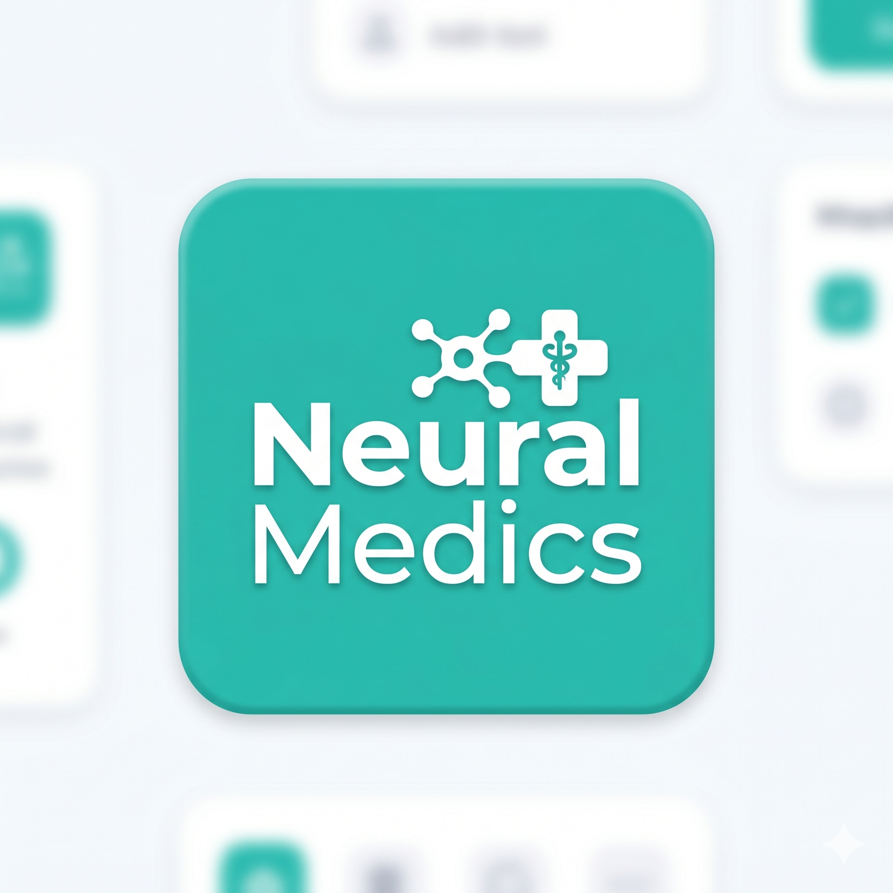
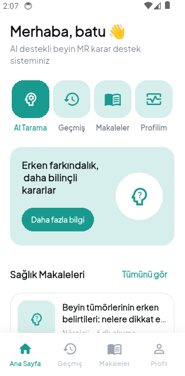
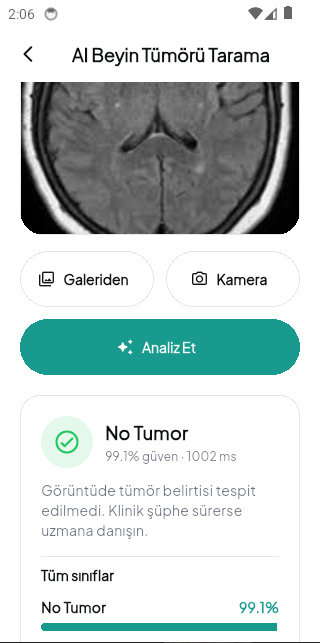
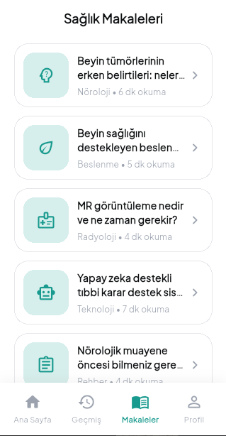
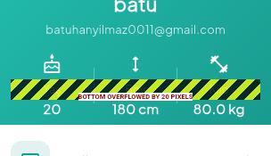

<div align="center">
  
</div>

<div align="center">

[](https://flutter.dev)
[](https://dart.dev)
[](https://firebase.google.com)
[](https://www.tensorflow.org/lite)
[](https://www.sqlite.org)
[](https://developers.google.com/identity)
</div>

<div align="center">
  
# NeuralMedics

Flutter ile geliştirilmiş, yapay zeka destekli beyin MR tümör sınıflandırma uygulaması.  
Firebase Auth + Firestore, yerel SQLite geçmişi ve TFLite on-device inference kullanır.

**Firebase projesi:** `neuralmedicsmobileapp`  
**Dil:** Türkçe arayüz  
</div>

---

## Ekran görüntüleri

| Ana Sayfa | AI Tarama |
|:---:|:---:|
|  |  |

| Sağlık Makaleleri | Profil |
|:---:|:---:|
|  |  |

---

## Hızlı başlangıç

Projeyi ilk kez veya uzun aradan sonra açtığında:

```powershell
cd neuralmedicsmobileapp
flutter pub get
flutter run
```

Model dosyası eklendiyse veya değiştiyse tam yeniden derleme:

```powershell
flutter clean
flutter pub get
flutter run
```

Cihaz listesi:

```powershell
flutter devices
flutter run -d <device_id>
```

---

## Gereksinimler

| Araç | Not |
|------|-----|
| [Flutter SDK](https://docs.flutter.dev/get-started/install) | Dart `^3.12` (pubspec ile uyumlu) |
| Android Studio / Xcode | Android veya iOS emülatör/cihaz |
| Firebase CLI (isteğe bağlı) | Auth / Firestore deploy için |

Kontrol:

```powershell
flutter doctor
flutter --version
```

---

## Özellikler

- **Kimlik doğrulama:** E-posta/şifre, Google Sign-In, şifre sıfırlama
- **Sağlık profili:** Yaş, cinsiyet, boy, kilo, kan grubu (Firestore `users/{uid}`)
- **AI tarama:** MR görüntüsü yükle → TFLite ile 4 sınıf tahmini
- **Tarama geçmişi:** Yerel SQLite (`sqflite`)
- **Makaleler & SSS:** Uygulama içi sağlık içerikleri

Alt menü: **Ana Sayfa · Geçmiş · Makaleler · Profil**

---

## AI modeli

| Dosya | Boyut | Açıklama |
|-------|-------|----------|
| `assets/ai/brain_tumor.tflite` | ~157 MB | Cihazda çalışan model |
| `ai_figma/Unet-BrainTumor.h5` | ~473 MB | Kaynak Keras modeli (TF 2.14 ile eğitildi) |

**Girdi:** `[1, 256, 256, 3]` float32, RGB 0–1  
**Çıktı:** `[1, 4]` softmax — sıra: Glioma, Meningioma, No Tumor, Pituitary  
**Servis:** `lib/features/ai_tumor/tumor_detection_service.dart`

Model dosyaları **Git LFS** ile repoda tutulur (`.gitattributes`). Clone sonrası `git lfs pull` gerekir.

Model yoksa uygulama **DEMO** modunda mock tahmin üretir.

### H5 → TFLite yeniden dönüştürme

```powershell
python -m venv .venv-convert
.\.venv-convert\Scripts\pip install -r scripts\requirements-convert.txt
.\.venv-convert\Scripts\python.exe scripts\convert_h5_to_tflite.py
```

Detay: `assets/ai/README.md` · Script: `scripts/convert_h5_to_tflite.py`

---

## Firebase yapılandırması

Projede hazır config dosyaları:

| Platform | Dosya |
|----------|-------|
| Android | `android/app/google-services.json` |
| iOS | `ios/Runner/GoogleService-Info.plist` |
| Flutter | `lib/firebase_options.dart` |

Google Sign-In web client ID: `lib/core/config/google_sign_in_config.dart`

### Auth & Firestore deploy (isteğe bağlı)

```powershell
npx -y firebase-tools@latest login
npx -y firebase-tools@latest use neuralmedicsmobileapp
npx -y firebase-tools@latest deploy --only auth,firestore:rules
```

**Not:** Android Google Sign-In için Firebase Console’da SHA-1 / SHA-256 parmak izleri kayıtlı olmalı.

Debug keystore SHA almak için:

```powershell
keytool -list -v -keystore "$env:USERPROFILE\.android\debug.keystore" -alias androiddebugkey -storepass android -keypass android
```

---

## Git & Git LFS (push)

Büyük model dosyaları normal git ile push edilemez (GitHub 100 MB limiti). Projede Git LFS yapılandırıldı:

| Dosya | Boyut | LFS |
|-------|-------|-----|
| `assets/ai/brain_tumor.tflite` | ~157 MB | Evet |
| `ai_figma/Unet-BrainTumor.h5` | ~473 MB | Evet |

### İlk push

```powershell
cd neuralmedicsmobileapp
git init
git lfs install
git add .gitattributes
git add .
git commit -m "NeuralMedics: Flutter AI brain tumor app"
git branch -M main
git remote add origin https://github.com/<kullanici>/<repo>.git
git push -u origin main
```

GitHub’da repo oluştururken **Git LFS**’in açık olduğundan emin ol (varsayılan açık).

### Clone (başka makinede)

```powershell
git clone https://github.com/batuhanyilmaz1/neuralmedicsmobileapp.git
cd neuralmedicsmobileapp
git lfs pull
flutter pub get
flutter run
```

LFS dosyalarının takip edildiğini doğrulamak için:

```powershell
git lfs ls-files
```

---

## Test ve analiz

```powershell
flutter analyze
flutter test
```

Release build (Android):

```powershell
flutter build apk --release
```

---

## Proje yapısı

```
lib/
├── main.dart                 # Firebase, Google Sign-In, router başlatma
├── firebase_options.dart
├── core/
│   ├── router/               # go_router + auth guard
│   ├── services/             # Auth, Firestore, tahmin repo
│   ├── database/             # SQLite tarama geçmişi
│   ├── models/               # UserProfile, PredictionRecord
│   └── theme/
└── features/
    ├── auth/                 # Giriş, kayıt, şifre sıfırlama
    ├── ai_tumor/             # MR tarama + TFLite
    ├── profile/              # Profil & sağlık formu
    ├── home/                 # Ana sayfa
    ├── history/              # Tarama geçmişi
    ├── articles/             # Sağlık makaleleri
    └── faq/                  # SSS

assets/
├── ai/                       # brain_tumor.tflite
├── images/
└── icons/
```

---

## Sık karşılaşılan sorunlar

| Sorun | Çözüm |
|-------|--------|
| `CONFIGURATION_NOT_FOUND` (kayıt) | Firebase Auth’ta E-posta/Parola açık mı kontrol et; SHA parmak izlerini ekle |
| Google giriş çalışmıyor | `google-services.json` + SHA-1/256 + `serverClientId` doğrula |
| Model yüklenmiyor / DEMO modu | `assets/ai/brain_tumor.tflite` var mı; `flutter clean && flutter run` |
| Büyük model APK boyutu | Normal (~157 MB); ileride quantize edilebilir |
| Profil kaydı sonrası yönlendirme | Sağlık profili tamamlanmamışsa `/profile-setup` açılır |

---

## Lisans

Bu proje MIT lisans ile lisanslanmıştır.
